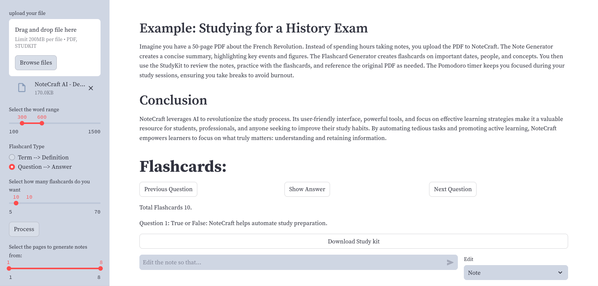
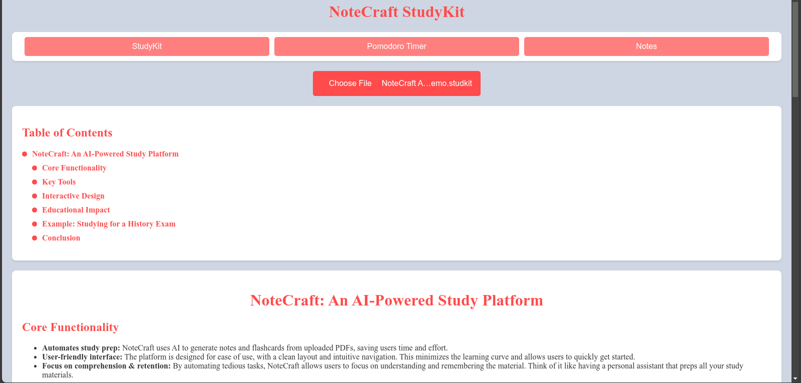

# 📝 NoteCraft AI

**NoteCraft AI** is a powerful, free, and open-source tool designed to create study materials (Notes and Flashcards)
---
## 🚀 Getting Started

### 1. Clone the repository and install the required packages:

```bash
pip install -r requirements.txt
```

### 2. Install `tesseract-ocr` and `poppler` (required for OCR functionality):

For Debian-based systems, run:

```bash
sudo apt install tesseract-ocr poppler-utils wkhtmltopdf
```

### 3. Run the application:

```bash
streamlit run 🏠_home.py
```

---

## 🌟 Features

- AI-powered **note generator**.
- **Flashcard generator** to create study materials for quick revision
- **StudyKits** AI generated documents that contain Notes, Flashcards, and the reference PDF that is used to create the Studykit
- Supports OCR for extracting text from images in PDFs

---

### Note Generator


### Flashcard Generator


---

### StudyKits
**StudyKits are Documents that contain both notes, flashcards**



**StudyKits can be viewed offline using the studykit viewer**

